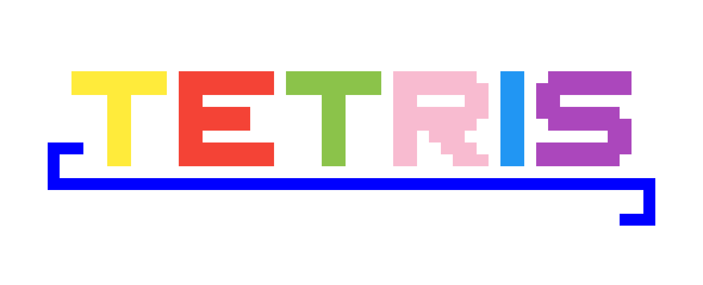

# ProjectTetris
Tetris Project of WSS CT12 2019

[Download JAR](Tetris.jar)

## Goal of this project

**Before beginning with any work, our team sat together and thought about some key features that should be present in a Tetris game. And so, the list below was created:**
1. visuals
   *  To make the game more visually pleasing, backgrounds colored bricks were considered.
1. Highscores
   *  Highscores would be saved by the game and shown to the current player. New highscores would wear an editable signature from the player that beat the older highscores
1. Bricks
   * The bricks would be randomly selected from a predetermined couple of shapes and colors. The player controls the bricks by rotating and moving them to progress in the level. To prematurely place a block, a faster fall speed would be present by activating it with a button.
1. Progress in-game
   * To keep the player invested in the game, increasing difficulty in form of faster falling blocks would be present.
1. Credits
   * The names of everyone involved in the creation of the game would be shown when a button labeled "credits" would be selected

## Management

**To complete the project in the predetermined timespan, every individual working on the project was assigned to one or more tasks which would in turn benefit the whole team.**
* **[ElyshaPhoenix](https://github.com/ElyshaPhoenix)** overviewed and organized the team, while he himself was working at the backend.
* **[programminghoch10](https://github.com/programminghoch10)** coordianted the team and was the main source of technical knowledge, while also working at the backend
* **[jjw2202](https://github.com/jjw2202)** was part of the ui team, designing and creating game screens as well as handling the communication between backend and frontend
* **[Hartu666](https://github.com/Hartu666)** was part of the ui team, designing the game over screen and creating various menus
* **[Juka27](https://github.com/Juka27)** was part of the ui team, creating the icon of the game and redesigning multiple menus
* **[Gr0g98](https://github.com/Gr0g98)** was part of the documentation team. He was also responsible for the creation of use-case diagrams.
* **[Ivan42069](https://github.com/Ivan42069)** was part of the documentation team. He was also responsible for the creation of class diagrams and the rework of the Tetris logo.

## Development progress

**To allow the ui team to code accordingly to the expectations, several use-case diagrams had to be created to visualise the individual routines present in the program. This task was completed by [Gr0g98](https://github.com/Gr0g98). He chose to visualize following steps:**
1.  [Starting the game](https://github.com/wssct12/ProjectTetris/blob/master/Use-Case%20(finished)/1.%20das%20Starten.pdf)
2.  [Opening the main menu](https://github.com/wssct12/ProjectTetris/blob/master/Use-Case%20(finished)/2.%20Men%C3%BC%20anzeigen.pdf)
3.  [Generating the main menu](https://github.com/wssct12/ProjectTetris/blob/master/Use-Case%20(finished)/3.%20Men%C3%BCstruktur.pdf)
4.  [Playing the game](https://github.com/wssct12/ProjectTetris/blob/master/Use-Case%20(finished)/4.%20Das%20Spielen.pdf)
5.  [Opening the pause menu](https://github.com/wssct12/ProjectTetris/blob/master/Use-Case%20(finished)/5.%20Das%20Aufrufen%20des%20Pausenmen%C3%BCs%20-%20Spiel%20unterbrechen.pdf)
6.  [Exiting the game](https://github.com/wssct12/ProjectTetris/blob/master/Use-Case%20(finished)/6.%20Spiel%20beenden.pdf)

**Additionally, the main classes had to be defined. To achieve this, [Ivan42069](https://github.com/Ivan42069) created specific class diagrams which are shown below:**

**With these preperations in place, the ui team could start to work on the code. And to keep the development clear for every party involved, the code was polished after every few of its evolving steps. It was achieved by being cleaned, restructured as well as getting new updates commented.**
* added temporary game matrix
* The first added classes were: "stone" "stone constructor" and "array stone type"
* Generate an empty frame
* Added relative coordinates for stones and set them up
* Added static matrix and rotation functionality
* Implemented a random initial rotation at the starting position when a new block is generated
* Added horizontal movement and the rate at which blocks drop down
* Added randomized background colors
* Added paralled processing
* Added a gameplay test area in the console
* To detect when blocks hit the last line, a last line detector was implemented
* Added the feature to fastdrop blocks
* Added randomized block colors
* Made the jpanelarray static and 2 dimensional to fit the gamematrix
* Increased the game refreshrate for a smoother experience
* Every full line of blocks nowgets removed
* Added controls to move blocks and pause the game
* The functionality of the pause menu is expanded
* Added borders to the game window
* Created a logo for the game
* Main menu is now put together
* Fixing up window and border size of the game
* Reduced flickering
* Rework of the pause menu
* Added a game over screen
* Added a stone placement prediction at the bottom of the window (ghost)
* Main menu gets redesigned
* Game over screen gets redesigned
* Added credits
* Added the feature of greyscaling the screen when paused
* The look of the user interface gets added

## Encountered problems and cut features

**Following errors and problems were encountered during development. The ui team worked on solutions to resolve those issues. The most memorable ones are listed below:**
* To coordinate every move of a stone, every individual case for every individual stone would have to be coded. This proves to be way too much.
  * **solution:** working object-oriented every stone position can be calculated. We only need to worry about further movements.
* While trying to add a predetermined list of blocks to drop, the game over screen is bypassed.
  * **solution:** instead of saving the next block to generate, save the type of the next block.
* Both pause menu and game over screen should include a grayscale when active. The grayscale however didnt apply.
  * **solution:** write a new if-query that checks if pause or gameover = true.
* The window adjusts itself without following any predetermined values, resulting in the window stretching out in all directions.
  * **solution:** use the method getPreferredSize() from JPanel to overwrite the value and set a size.
  
**Some expectations prove too difficult for our team to realise in the available time and had to be cut during development. The most important ones are listed below:**
 * The pause screen menu
 * The local saved high scores
 * The background music
 
## Future outlook

**The game has been brought to finish and is now in a playable state. Our team however still had many ideas to continue the project:**
  Adding different music trcks for the menus and the playing environment
* Online high scores to compete between players
* A list of credits with full names which can be brought up through a main menu button and closed whenever the player wishes
